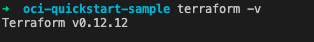
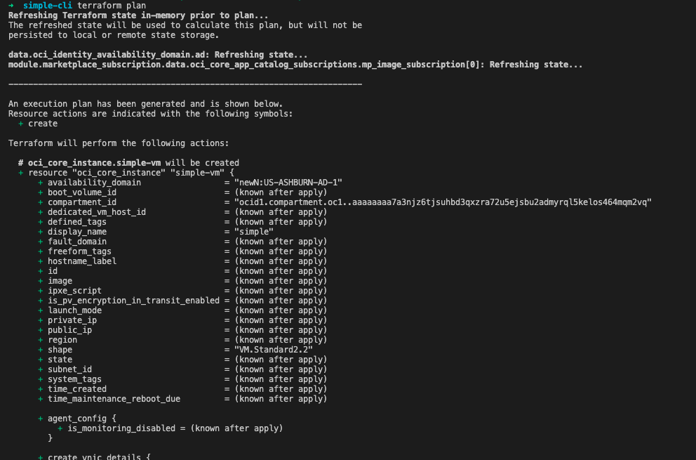
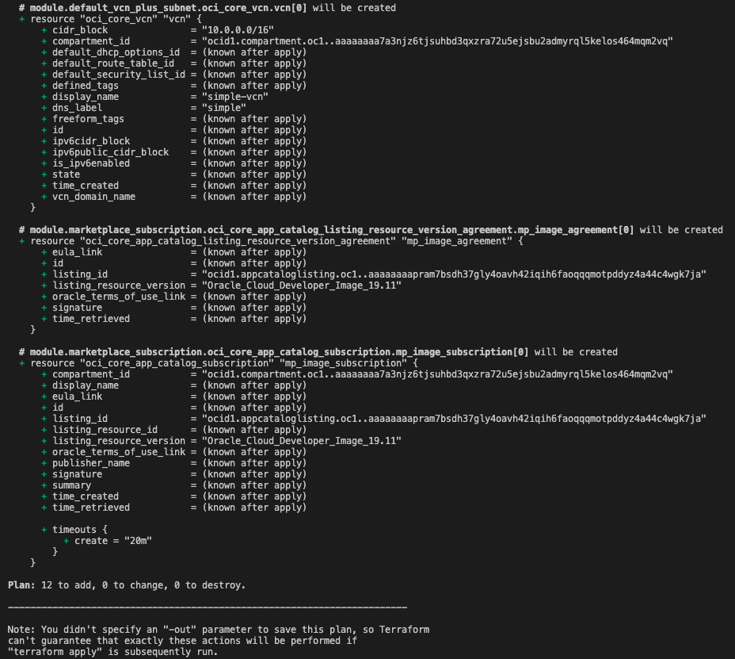
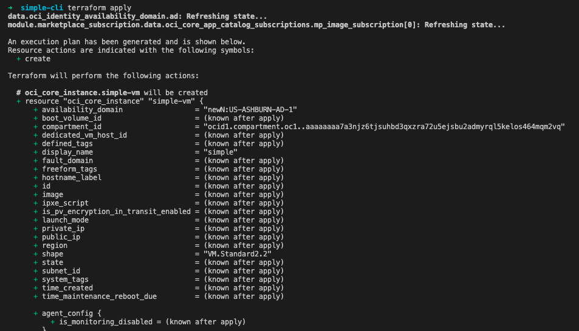
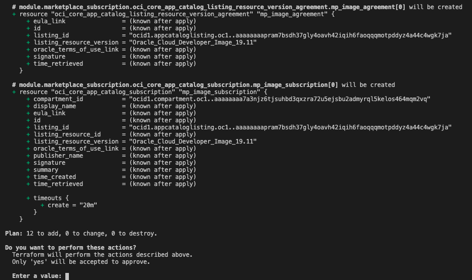
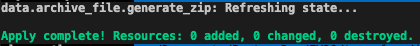
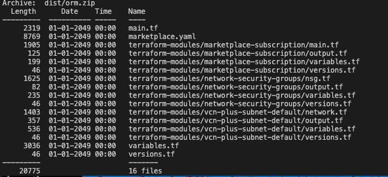
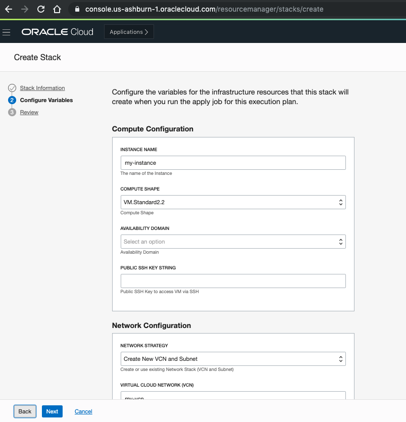

# Simple

Simple is a sample template that subscribes and launches an image from Oracle Cloud Infrastructure Marketplace.

## How to use simple-cli

1. Make sure you have terraform v0.12+ cli installed and accessible from your terminal.

```bash
terraform -v
```



2. Go to simple-cli folder and update default variable values on [variables.tf](./simple-cli/variables.tf). At least *Marketplace Image* and *Compute Configuration* sections should be updated. Marketplace Partner Administrators can navigate through the [Partner Portal](https://partner.cloudmarketplace.oracle.com/partner/index.html) to retrieve this information. Go to Listings -> Published tab -> Right Menu of your listing -> View Listing -> App Install Package -> Select a specific version of your image and update the values. Take notes on the following fields:

    - Listing OCID
    - Package Version Reference
    - Image OCID


Here is the snippet of the `variables.tf` file:

```hcl
############################
#  Marketplace Image      #
############################

variable "mp_listing_id" {
  default = "ocid1.appcataloglisting.oc1.."
  description = "Marketplace - Listing OCID"
}

variable "mp_listing_resource_id" {
  default = "ocid1.image.oc1.."
  description = "Marketplace - Image OCID"
}

variable "mp_listing_resource_version" {
  default = "1.0"
  description = "Marketplace - Package Version Reference"
}

############################
#  Compute Configuration   #
############################

variable "vm_display_name" {
  description = "Instance Name"
  default     = "simple"
}

variable "vm_compute_shape" {
  description = "Compute Shape"
  default     = "VM.Standard2.2" //2 cores
}
```

3. You can define all default values directly on [variables.tf](./simple-cli/variables.tf). However, variables that you want users to specify the value during runtime or you don't want the value persisted on a version control system (as it may contains sensitive data), you can make use of environment variables or typically, terraform.tfvars file.
You can use the boilerplate available on [terraform.tfvars.template](terraform.tfvars.template) to setup the OCI provider variables or overwrite the variables values defined on [variables.tf]. Rename the file to `terraform.tfvars` so that Terraform CLI can automatically pick it up as the default variables configuration.

4. Initialize your template.

This gives the following output:

```bash
terraform init
```


5. Now you should run a plan to make sure everything looks good:

```bash
terraform plan
```

That gives:



6. Finally, if everything is good, you can go ahead and run `apply`:

```
terraform apply # will prompt to continue
```

The output of `terraform apply` should look like:




7. You now can connect via SSH or HTTPS through the public IP address of the Instance.

8. If you want to destroy the resources previously created. Run `terraform destroy`.


9. Finally, you can modify and extend the existing code based on your needs. To better organize your project, create a new folder for each different product you have. Place each product on its own folder and copy both simple-cli/simple-orm projects into the new product folder. Add new architectures (e.g. HA) and create a new folder for that, e.g. ha-cli/ha-orm. Re-usable terraform modules can be added into [terraform-modules](terraform-modules) folder.

## How to use simple-orm

[simple-orm](./simle-orm) is just a wrapper for packaging [simple-cli](./simple-cli) into the format supported by OCI Resource Manager. In a nutshell, this template will zip [simple-cli](./simple-cli) and remove some files that are not required by ORM, making it easier to deploy.

1. In order to launch it, make sure you have terraform v0.12+ cli installed and accessible from your terminal.

2. Ensure all variables were specified based on *steps 2 and 3* of the above section - "How to use simple-cli".

3. Update simple-cli [Marketplace schema](./simple-cli/marketplace.yaml) template file that exposes the variables to end users on ORM. More information related to Marketplace schema is available [here](https://github.com/oracle-quickstart/oci-quickstart/blob/master/partners/marketplace_stack_schema.md)

3. Initialize your template.

```bash
terraform init
```

This gives the following output:


5. Now, you can go ahead and run `apply`. That will generate [orm.zip](./simple_orm/dist/orm.zip) on `/simple_orm/dist` folder :


You can run `unzip -l dist/orm.zip` and confirm the content of the zip file:



6. Alternatively, you can specify a different path to store the zip file by specifying a variable argument `save_to` during apply: `terraform apply -var="save_to"="path/to/zip"`
 
7. Finally, Create a Stack on OCI Resource Manager, configure all the variables and launch it.

